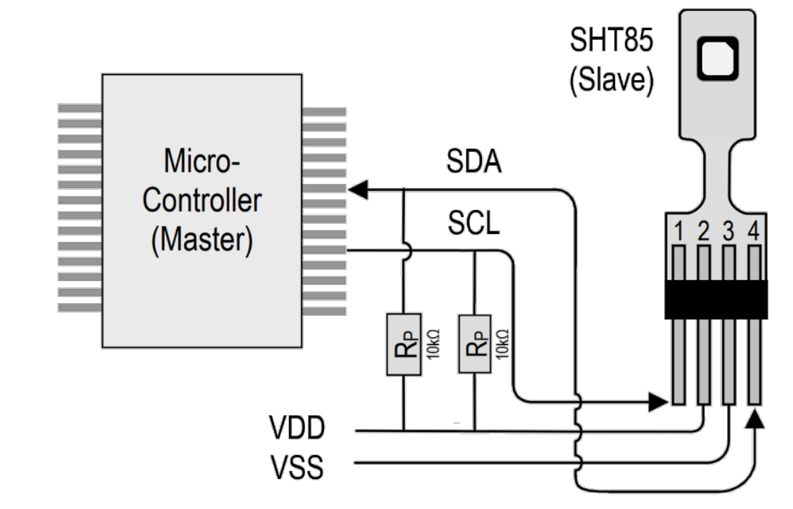
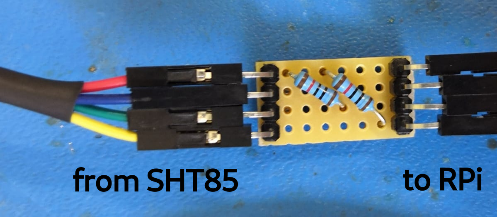
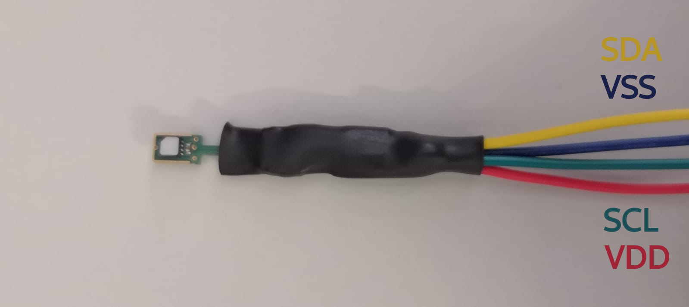
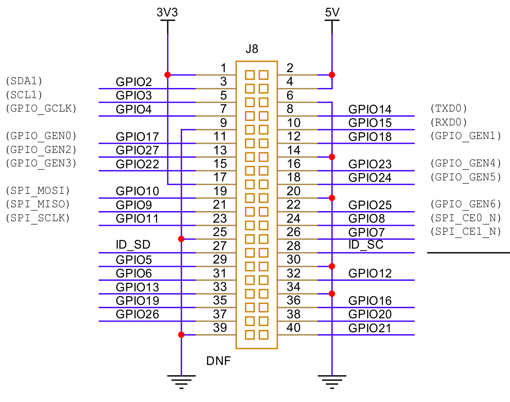

# SHT 85
This project involves logging temperature and humidity data, creating daily reports on the measurements and uploading the reports to a cloud system. 

## Project Overview
The project consists of two parts:
+ Script `sht85.py`: Controlling the temperature and humidity sensor [SHT85](https://sensirion.com/products/catalog/SHT85 "Sensirion digital humidity and temperature sensor") with the [Raspberry Pi Zero 2W](https://www.raspberrypi.com/products/raspberry-pi-zero-2-w/ "Raspberry Pi Zero 2W on raspberrypi.com"). 
+ `upload.sh` (together with `mergeData.py` and `plot.py`): Creating a simple daily report and uploading the data/report to the cloud system.

Throughout the day, the Raspberry Pi collects temperature and humidity data and saves it at regular intervals. At the end of each day, the collected data is merged into a single file, which is then plotted. Then, the data and the plot are uploaded to [ownCloud](https://owncloud.com/de/) (using [RClone](https://rclone.org/)).
For scheduling the measurements and the upload, [cron](https://wiki.debian.org/cron) is used.

## Setting up the RaspberryPi
1. Install Raspberry Pi OS to SD card (a step by step guide can be found [here](https://www.raspberrypi.com/documentation/computers/getting-started.html#installing-the-operating-system "Raspberry Pi Imager Documentation"). Don't forget to
+ configure wireless LAN 
+ select an appropriate hostname, username and password (currently the hostnames are `pizero[i]` (e.g. `pizero1`), usernames are `pi[i]`(e.g. `pi1`) and passwords are `pi[i]_pswd` (e.g. `pi1_pswd`))
+ enable SSH
1. Connect the SHT85 sensor to the Raspberry Pi (see next section).
1. Insert the SD card into the Pi's SD card slot and power up the Raspberry Pi. Once the boot process is finished (booting for the first time may take a few minutes), connect via SSH (`ssh [username]@[hostname].local`, e.g. `pi1@pizero1.local`) and activate the I2C interface (run `sudo raspi-config`, go to interfacing options and select I2C).
1. In case `i2c-tools` isn't already pre-installed, install it via `sudo apt install i2c-tools`.
1. Check that the Raspberry Pi can communicate with the SHT85 sensor: List the connected I2C devices using the command `i2cdetect -y 1`. If the connection can be established, `i2cdetect -y 1` should output something similar to the following: TODO, image
1. Install python libraries: smbus, numpy, matplotlib (smbus, numpy are usually pre-installed)
1. Install RClone `apt install rclone`, run `rclone config`. In order to establish a connection to ownCloud proceed as follows:
+ Select "New remote".
+ Enter a name for the remote (e.g. owncloud, you can choose a different name, but `upload.sh` needs to be changed accordingly).
+ Choose WebDAV as type of storage.
+ Enter `https://owncloud.gwdg.de/remote.php/nonshib-webdav` as url of host.
+ Select OwnCloud as the WebDAV service.
+ Enter your username and press Enter. Select 'Yes, type in my own password' and enter your password.
+ Option 'bearer_token': don't enter a value, press Enter. (TODO: why?)
+ Advanced Config: select No.
+ Confirm the settings and quit the configuration.
+ Enter `rclone lsd [name of the remote]:` (e.g. `rclone lsd owncloud:`). In case the configuration was succesfull, you should see a complete list of all directories you currently have on your owncloud.
1. In the Raspberry Pi's home directory, create a folder called SHT85 and clone this repository.
1. In `upload.sh` change the variable `title` to a meaningfull name (this will be the title of the plots generated at the end of the day, i.e the place where the Pi performs the measurement would be a reasonable title). Make `upload.sh` executable: `chmod u+x upload.sh`. 
1. Run `crontab -e` and append the following lines (`2>&1` redirects stderr(2) to stdout(1))
```
    */2 * * * * python ~/SHT85/sht85.py $(whoami) 1mps 118>>~/SHT85/crontab_log.txt 2>&1
    0 1 * * * ~/SHT85/upload.sh>>~/SHT85/crontab_log.txt 2>&1
```
Of course, the timing as well as the mps and measurement time settings can be changed to whatever is needed (explanations of crontab syntax can be found for example on [Wikipedia](https://en.wikipedia.org/wiki/Cron "Wiki Crontab").

## Connecting the SHT85 to the Raspberry Pi
According to the [SHT manual](https://sensirion.com/media/documents/4B40CEF3/640B2346/Sensirion_Humidity_Sensors_SHT85_Datasheet.pdf "Manual SHT85"), the sensor should be connected as follows:
<p align="center">
  
</p>
In the currently used setup, the resistors are soldered to a small perfboard. The sensor and the Raspberry Pi can each be connected to one side of the board. See the the following pictures (VDD is red, VSS blue, SCL green and SDA yellow):
<p align="center">
  
</p>
<p align="center">
  
</p>


The [Raspberry Pis Pinout](https://pinout.xyz/ "pinout.xyz") is as follows (orientation of the Raspberry Pi: PINS on the right, SD card on the top):
<p align="center">
  
</p>
Thus, connect the SHT85 and Raspberry Pi as follows (don't forget the resistors between SDA/SCL and VDD as shown in the picture above!):
 
|Pin SHT85|Pin Raspberry Pi|
|---------|----------------|
|1 (SCL, green)|5 (GPIO3, SCL1)|
|2 (VDD, red)|1 (3V3)|
|3 (VSS, blue)|6 (Ground)|
|4 (SDA, yellow)|3 (GPIO2, SDA1)|

## Troubleshooting
The Raspberry Pi automatically generates a log file (called `crontab_log.txt`). In case there is a software issue, having a look at this file might help
In case the automatic upload procedure did not work for whatever reason. 

Known problems:

|pi|hardware/software|Problem description|Solution|
|--|----|-------------------|--------|
|pi1|hardware|unstable WLAN connection due to broken resistor/capacitor| -| 

## TODO
+ clear crontab_log.txt every seven days

